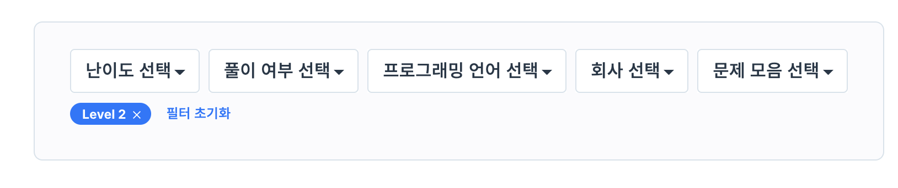
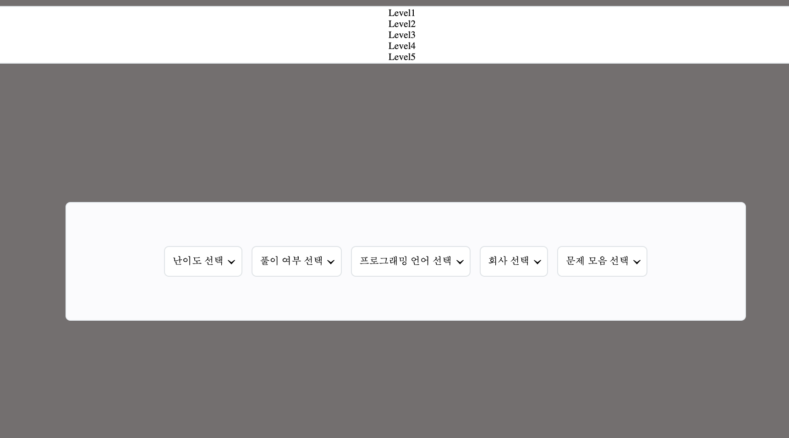
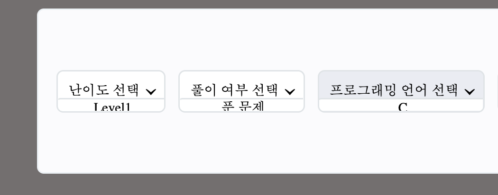
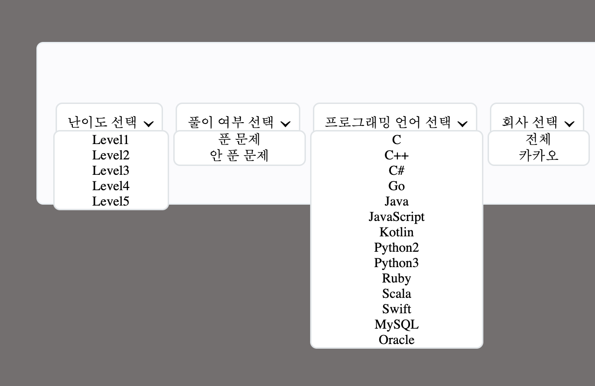

# programmers-dropdown-copy

프로그래머스 문제를 풀다가 드롭다운 박스가 괜찮아 보여서 따라해보기로 했다.
생각 보다 기능들이 많아서 재미있을 것 같다.

---

### Vanilla JavaScript를 사용한 이유.

만들면서 React를 사용했다면 좀 더 간편하게 만들 수 있을 거라고 생각했지만
최대한 기본적인 것들을 공부해보기 위하여 사용하게 됐다.

---

### 실수

1. 자식요소(dropdown)에 position: fixed; 사용
   
   처음에 dropdown 창을 어떻게 만들까 생각하다가 position fixed를 사용했을 때 위와 같이 떠 있어서, 부모요소에 position: relative, overflow: hidden을 사용하고 자식요소에 position: absolute; 를 사용하라는 글을 보고 따라했는데, 아래와 같이 됐다.

2. 부모요소에 overflow: hidden; 사용
   
   위와 같이 dropdown이 안에 있고 밖으로 나오지 않아서 z-index 등 여러가지 다른 것들을 만지다가 overflow가 문제였다는 것을 알았다. 내가 찾아봤던 글은 아마 다른 문제에 대한 해결 방법을 제시하는 글이였던것 같다.

- 결론적으로 Dropdown을 만드는데는 기본적으로 부모요소에 position: relative, 자식요소에 position: absolute를 넣어야 한다는 것을 알았다.
  > 부모요소 position: relative; \
  > 자식요소 position: absolute;
  > 
