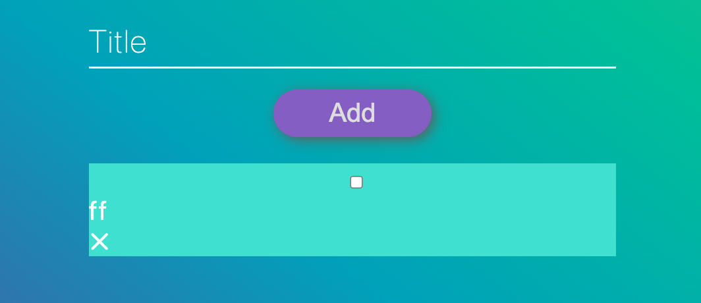

## Dropdown-CloneCoding

### 참조 Url: https://www.youtube.com/watch?v=uUT1yMKCWcQ

Dropdown을 만들어보다가 막히는 부분이 있어서 유튜브에서 Vanilla.js로 dropdown 만드는 것을 따라해보았다.
드랍다운은 아니었지만 내가 원했던 input-checkbox를 조작하는 내용이 있어서 따라 만들면서 공부해봤다.

---

새롭게 알게 된 내용도 많았고 몇몇 부분은 다른 것을 만들 때도 유용할 것 같아 많은 공부가 되었다.
_특히 placeholder float는 나에게는 세련된 기술이어서 기록해두고 나중에도 써보고 싶다._

- 입력창을 클릭하기 전
  

- 입력창을 클릭한 후
  

그리고 재미있었던 부분은 CSS가 완전히 공개되지 않아 버튼 이하로는 나 스스로 생각하여 만들었는데, 스스로 찾아보며 만들 수 있어서 더 도움이 되었던 것 같다.

