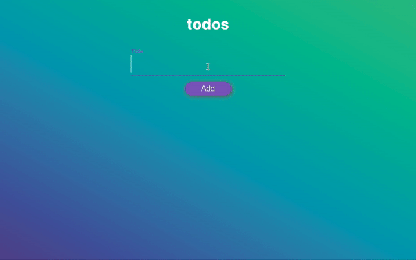

## Dropdown-CloneCoding

### 참조 Url: https://www.youtube.com/watch?v=uUT1yMKCWcQ

Dropdown을 만들어보다가 막히는 부분이 있어서 유튜브에서 Vanilla.js로 dropdown 만드는 것을 따라해보았다.
드랍다운은 아니었지만 내가 원했던 input-checkbox를 조작하는 내용이 있어서 따라 만들면서 공부해봤다.

---

새롭게 알게 된 내용도 많았고 몇몇 부분은 다른 것을 만들 때도 유용할 것 같아 많은 공부가 되었다.
_특히 placeholder float는 나에게는 세련된 기술이어서 기록해두고 나중에도 써보고 싶다._

- 입력창을 클릭하기 전
  

- 입력창을 클릭한 후
  

```css
div#header div#input-container input#todo-input {
  border: 0;
  border-bottom: 2px solid white;
  outline: 0;
  font-size: 50px;
  color: white;
  padding: 7px 0;
  background: transparent;
  transition: 0.2s;
  letter-spacing: 1.25px;
}

div#header div#input-container label {
  position: absolute;
  top: 15px;
  z-index: -1;
  display: block;
  transition: 0.2s;
  font-size: 16px;
  color: white;
  font-weight: 600;
}

div#header div#input-container input#todo-input:placeholder-shown ~ label {
  top: 45px;
  color: white;
  font-size: 30px;
  font-weight: 100;
}
div#header div#input-container input#todo-input:focus ~ label {
  top: 0px;
  font-size: 16px;
  color: #845ec2;
  font-weight: 600;
}
```

> 간략히 설명하자면 처음에 input을 투명하게 만들고 거기에 lable이 들어가서 placehoder 처럼 보이게 하고 클릭 해서 focus가 되면 레이블이 위로 올라고 투명한 input이 드러나는 것이다. 이때 디테일은 placeholder-shown을 지정하여 focus가 되지 않은 상태라도 input에 글이 있으면 레이블이 input을 침범하지 않게 하는 것이다.

또 재미있었던 부분은 CSS가 완전히 공개되지 않아 버튼 이하로는 나 스스로 생각하여 만들었는데, 간단한 것을 스스로 찾아보며 수정해보니, 복습할 기회가 되서 코드에 대한 이해를 높일 수 있었다.

클론 버전


수정 완성 버전

